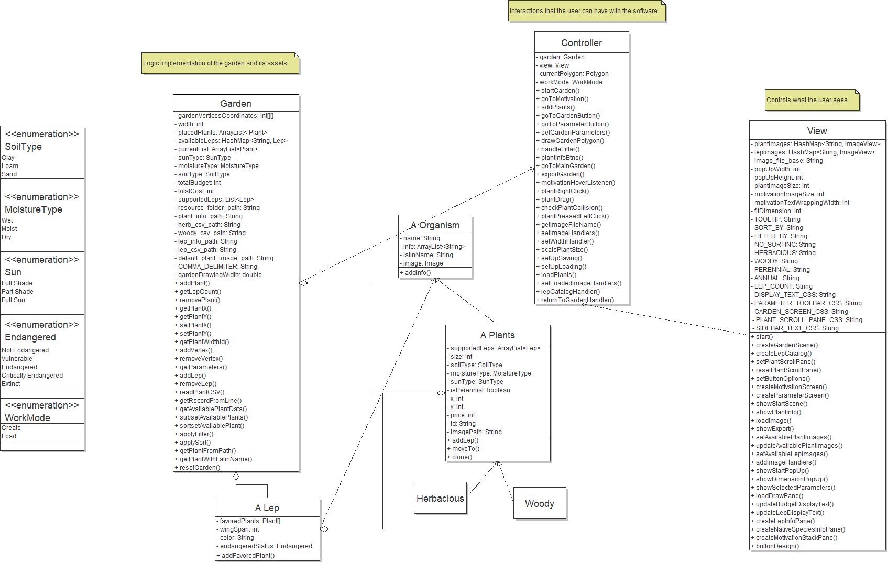

# SnapLeaf

This software is designed for the Mt. Cuba Center. It focuses on enabling simpler plant design based on a number of factors that can be set by the user
primarily the focus of the software is to design a garden such that specific species of [Lepidoptera]() can be supported.
The software utilizes simple UI tools to allow the user to drag and drop plants onto a designated garden area. All plants are
native to Delaware and will show Lepidoptera that may come to these plants. The user can either save their progress or export the
garden to a simple PDF to be viewed later.

## UML Diagram
